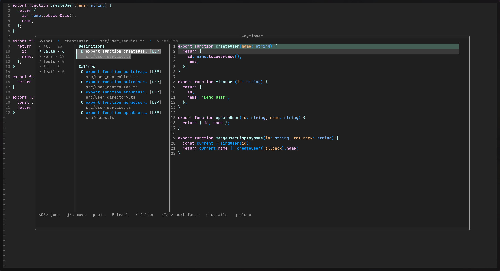
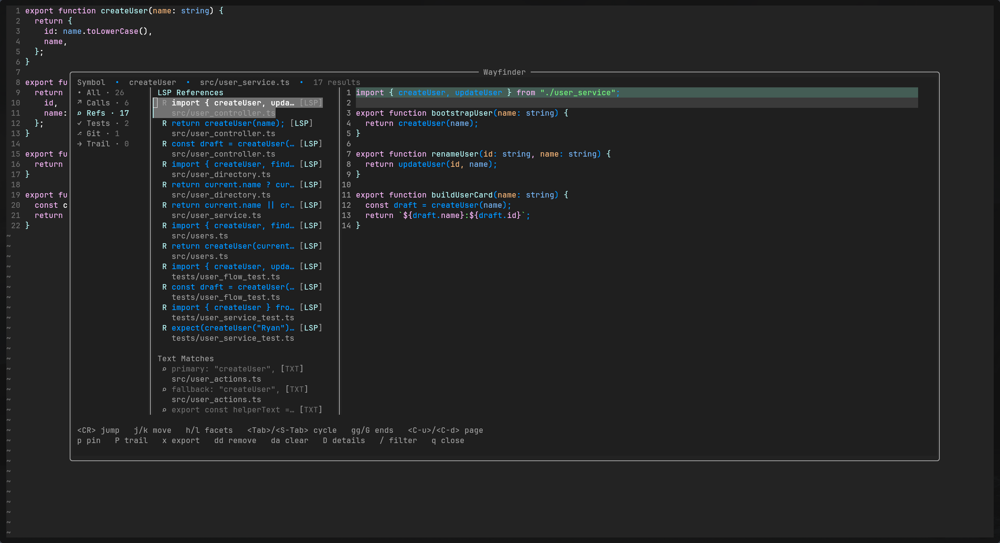
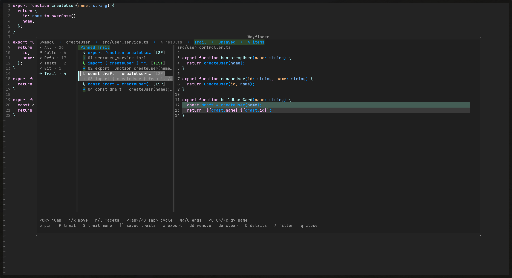

# wayfinder.nvim

`wayfinder.nvim` is a guided code exploration tool for the current symbol.

Wayfinder is not a general search tool. It does not try to replace Telescope or grep.
It replaces the manual loop of jump, grep, back, open, back, and "where was that test again?"

From the current symbol or file, Wayfinder gathers the most relevant nearby code:

- definitions
- references
- callers
- likely tests
- recent commits

It opens as a centered 3-pane picker, loads sources progressively, and keeps the screen focused on facets, rows, badges, previews, and a Trail you can actually keep.

Pin useful stops into Trail while you explore, then save that Trail per project and reload it later when you want the same path back.








## Features

- Centered 3-pane floating layout
- Facet rail with counts
- Dense result list with badges and grouped headers
- Syntax-highlighted preview
- Trail facet for pinned breadcrumbs
- Persistent named Trails per project
- Async, cancelable LSP loading plus async tests and git loading
- Local filter with negation and phrase matching
- Jump actions

## Requirements

- Neovim `0.10+`

## Installation

With `lazy.nvim`:

```lua
{
  "error311/wayfinder.nvim",
  opts = {},
}
```

## Quick Start

Wayfinder works with the default setup:

```lua
require("wayfinder").setup({})
vim.keymap.set("n", "<leader>wf", "<Plug>(WayfinderOpen)", { desc = "Wayfinder" })
```

Open it on a symbol for definitions, references, callers, likely tests, and recent commits.
If there is no symbol under the cursor, it falls back to the current file.

## Typical Flow

1. Open Wayfinder on the current symbol or file.
2. Move across `Calls`, `Refs`, `Tests`, `Git`, and `Trail`.
3. Use preview to confirm the right match before jumping.
4. Pin useful stops into Trail while exploring.
5. Save or reload a Trail later if you want to keep that exploration path.

## Optional Setup

If you want to tune the layout, keep it small:

```lua
require("wayfinder").setup({
  layout = {
    width = 0.88,
    height = 0.72,
  },
})
```

## Large Repos and Monorepos

You do not need to set any scope or performance options for normal repos.

If you work in a large repo or monorepo, Wayfinder can narrow broad sources like
text matches, likely tests, and git history, while keeping slow LSP work bounded.

Mental model:

- `project`: search the whole project, usually the git root
- `package`: search the nearest app/package/module root
- `cwd`: search from the current Neovim working directory
- `file_dir`: search from the current file directory

Common monorepo setup:

```lua
require("wayfinder").setup({
  performance = "fast",
  scope = {
    mode = "package",
    package_markers = {
      "package.json",
      "tsconfig.json",
      "pyproject.toml",
      "go.mod",
      "Cargo.toml",
      ".git",
    },
  },
  limits = {
    refs = { max_results = 200, timeout_ms = 1200 },
    text = { enabled = true, max_results = 100, timeout_ms = 800 },
    tests = { max_results = 50, timeout_ms = 700 },
    git = { enabled = true, max_commits = 15, timeout_ms = 400 },
  },
})
```

Those `package_markers` are just common defaults. They are not required files, and you can override them if your repo uses different boundaries.

`performance` presets:

- `fast`: tighter limits and shorter timeouts
- `balanced`: default behavior
- `full`: broader limits and looser timeouts

## Recommended Mappings

```lua
vim.keymap.set("n", "<leader>wf", "<Plug>(WayfinderOpen)", { desc = "Wayfinder" })
vim.keymap.set("n", "<leader>wtn", "<Plug>(WayfinderTrailNext)", { desc = "Wayfinder Trail Next" })
vim.keymap.set("n", "<leader>wtp", "<Plug>(WayfinderTrailPrev)", { desc = "Wayfinder Trail Prev" })
vim.keymap.set("n", "<leader>wto", "<Plug>(WayfinderTrailOpen)", { desc = "Wayfinder Trail Open" })
vim.keymap.set("n", "<leader>wts", "<Plug>(WayfinderTrailShow)", { desc = "Wayfinder Trail Show" })
```

## Commands

Core:

- `:Wayfinder`
- `:WayfinderExportQuickfix`
- `:WayfinderExportTrailQuickfix`

Trail:

- `:WayfinderTrailNext`
- `:WayfinderTrailPrev`
- `:WayfinderTrailOpen`
- `:WayfinderTrailShow`
- `:WayfinderTrailSave`
- `:WayfinderTrailSaveAs`
- `:WayfinderTrailLoad`
- `:WayfinderTrailDelete`
- `:WayfinderTrailRename`

Mappings:

- `<Plug>(WayfinderOpen)`
- `<Plug>(WayfinderTrailNext)`
- `<Plug>(WayfinderTrailPrev)`
- `<Plug>(WayfinderTrailOpen)`
- `<Plug>(WayfinderTrailShow)`

## Default Keys

- `j` / `k` move
- `gg` / `G` first / last result
- `<PageUp>` / `<PageDown>` page movement
- `<C-u>` / `<C-d>` move by half a page
- `h` / `l` switch facet
- `<Tab>` next facet
- `<S-Tab>` previous facet
- `<CR>` jump
- `s` open in split
- `v` open in vsplit
- `t` open in tab
- `p` pin into Trail
- `P` open Trail immediately
- `S` open Trail menu
- `[` previous saved Trail
- `]` next saved Trail
- `x` export current facet to quickfix
- `dd` remove pinned trail item
- `da` clear Trail
- `/` filter
- `<C-l>` clear filter
- `D` toggle details
- `r` refresh
- `q` close
- mouse wheel scrolls results

## Trail

Trail is the working breadcrumb list you build while exploring.

Core Trail actions:

- `p` pins the current item
- `P` opens the Trail facet
- `S` opens the Trail menu for save/load/rename/delete actions
- `[` / `]` cycle through saved Trails for the current project
- `dd` removes the selected Trail item
- `da` clears the current Trail

Trail commands outside Wayfinder:

- `:WayfinderTrailNext` opens the next Trail item
- `:WayfinderTrailPrev` opens the previous Trail item
- `:WayfinderTrailOpen` opens the current Trail item
- `:WayfinderTrailShow` opens Wayfinder on the Trail facet

Persistent named Trails:

- saved Trails are project-scoped and stored under Neovim state, not in your repo
- nothing persists automatically just because you pin items
- if you never save a Trail, ordinary Trail behavior stays the same
- `:WayfinderTrailSave` saves the current working Trail
- `:WayfinderTrailSaveAs` saves the current working Trail under a different name
- `:WayfinderTrailLoad` loads a saved Trail back into the current working Trail
- `:WayfinderTrailRename` renames a saved Trail
- `:WayfinderTrailDelete` deletes a saved Trail entry
- once a saved Trail is loaded, `Save Trail` updates that same saved Trail and `Save Trail As` creates a named variant

Top bar Trail states:

- `Trail • unsaved • 3 items`
- `Trail: auth bug • 3 items`
- `Trail: auth bug • modified`

Filter examples:

- `user` matches `user`
- `user test` requires both terms
- `user !spec` excludes matches containing `spec`
- `"user service"` matches that exact phrase
- `create !"git status"` excludes that exact phrase

Quickfix export:

- `:WayfinderExportQuickfix` exports the current visible facet in its current order
- `:WayfinderExportTrailQuickfix` exports Trail in Trail order

## Result Types

- `Calls` shows LSP definitions and callers
- `Refs` is split into `LSP References` and `Text Matches`
- weak-source reasons now show up in the top bar for the current selection
- `Tests` is heuristic and intentionally ranked below calls and refs
- `Tests` can show a small heuristic reason like filename or symbol-text matching
- `Git` shows recent commits touching the current file
- `Git` can show a small file-touch reason while commit metadata stays in details

## Scope and Performance

- `scope.mode` controls how far Wayfinder searches:
  - `project` uses the project root
  - `cwd` uses the current Neovim working directory
  - `package` uses the nearest package/module marker
  - `file_dir` uses the current file directory
- `limits` can cap expensive sources without changing the UI model:
  - `refs.max_results`, `refs.timeout_ms`
  - `text.enabled`, `text.max_results`, `text.timeout_ms`
  - `tests.max_results`, `tests.timeout_ms`
  - `git.enabled`, `git.max_commits`, `git.timeout_ms`

With package scope enabled, Wayfinder keeps text matches, likely tests, and other broad searches inside the nearest app or module instead of spilling across the full repo.

## Demo Fixture

The repo includes a small fixture app plus a tiny demo LSP so screenshots and gifs are reproducible.

```sh
nvim -u demo/minimal_init.lua demo/fixture-app/src/user_service.ts
```

Move the cursor onto `createUser`, then run `:Wayfinder`.

More demo notes are in [demo/README.md](demo/README.md).

## Health

`:checkhealth wayfinder` reports:

- Neovim version
- plugin load status
- `ripgrep` availability for Text Matches
- `git` availability for the Git facet
- active LSP clients for the current buffer
- resolved scope root for the current buffer
- current `performance` and `scope.mode` config

```vim
:checkhealth wayfinder
```

## License

MIT
